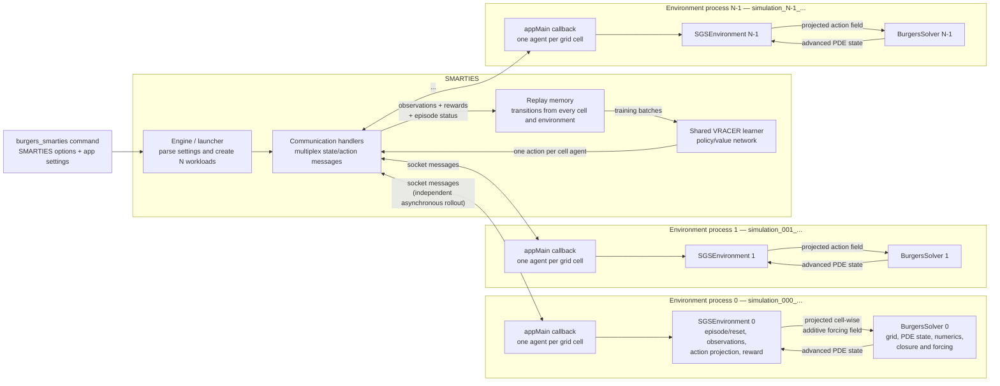
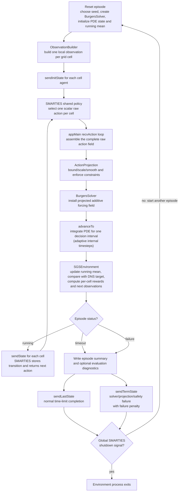

# SMARTIES/Burgers interaction flowchart

## Runtime architecture

`--nEnvironments N` creates `N` independent rollout processes. Each process
has its own `SGSEnvironment`, `BurgersSolver`, PDE state, random stream,
episode clock, and simulation directory. They do not exchange PDE state with
one another. They only interact indirectly by contributing experience to, and
requesting actions from, the shared SMARTIES learner.

For a Burgers grid with `C` cells, every environment registers `C` SMARTIES
agents. Agent `i` observes the local stencil around cell `i`, returns one scalar
action, and receives cell `i`'s reward. The supplied `settings.json` creates a
single learner, so one policy is reused across all `N * C` logical agents.

## One environment's decision loop

The following loop runs independently in every environment process.

The application sends and receives cell-agent messages one at a time, but the
`N` environment processes progress independently. Consequently a slow Burgers
rollout does not require all other environments to reach the same physical
time before their next policy request.

During training, SMARTIES adds the returned transitions to replay memory and
updates the shared policy. During evaluation, the network is frozen; configured
held-out seeds are used, and optional detailed Burgers output is recorded.

## Code map

- SMARTIES entry point and cell-agent communication:
  [`src/environment/smarties_main.cpp`](src/environment/smarties_main.cpp)
- Environment reset, action projection, solver advancement, and rewards:
  [`src/environment/SGSEnvironment.cpp`](src/environment/SGSEnvironment.cpp)
- PDE solver owned by each environment:
  [`src/BurgersSolver.cpp`](src/BurgersSolver.cpp)
- SMARTIES process creation and per-simulation directories:
  [`../../source/smarties/Core/Launcher.cpp`](../../source/smarties/Core/Launcher.cpp)
- SMARTIES state/action routing and learner selection:
  [`../../source/smarties/Core/Worker.cpp`](../../source/smarties/Core/Worker.cpp)

